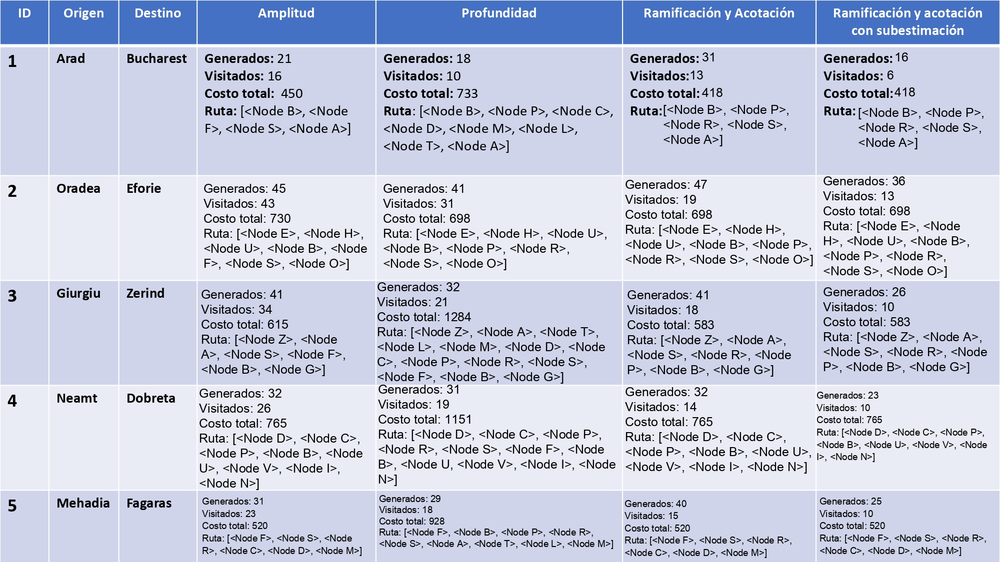

# Práctica 2 – Fundamentos de los Sistemas Inteligentes

## Estrategias de Búsqueda:

## Introducción

Esta práctica parte del **código base proporcionado** para la asignatura *Fundamentos de los Sistemas Inteligentes*, el cual implementa algoritmos de búsqueda en grafos como BFS, DFS y Ramificación y Acotación aplicados al problema de navegación en el mapa de Rumanía (`GPSProblem`).

El objetivo de la práctica es ampliar dicho código para incorporar nuevas estrategias de búsqueda informada, manteniendo la funcionalidad original y respetando las interfaces existentes.

---

## Parte 1 – Ramificación y Acotación

### Descripción

Se ha añadido al código base la estrategia de búsqueda **Ramificación y Acotación (Branch and Bound)**.  
Esta estrategia explora el espacio de búsqueda priorizando aquellos nodos cuyo coste acumulado es menor.

El coste acumulado se gestiona mediante el atributo `path_cost` del nodo, ya presente en el código base.

### Implementación

La estrategia se ha implementado utilizando una **cola de prioridad**, que permite seleccionar en cada iteración el nodo con menor coste acumulado (`path_cost`), cumpliendo el principio de Ramificación y Acotación.

```python
fringe = []
counter = 0
```

Se inicializa la **frontera** como una cola de prioridad (`fringe`) y un contador auxiliar (`counter`) que se utiliza para desempatar nodos con el mismo coste, evitando errores de comparación entre objetos `Node`.

```python
start = Node(problem.initial)
heapq.heappush(fringe, (start.path_cost, counter, start))
counter += 1
```

Se crea el nodo inicial y se inserta en la cola de prioridad con coste cero.  
Cada elemento de la cola tiene la forma `(coste, contador, nodo)`.

---

```python
generated = 1
visited = 0
```

Se inicializan los contadores de **nodos generados** y **nodos visitados**, que permiten analizar el rendimiento del algoritmo.

---

```python
best_cost = {problem.initial: 0}
```

Este diccionario almacena el **menor coste conocido** para alcanzar cada estado.  
Se utiliza para implementar la **acotación**, evitando expandir caminos peores que otros ya explorados.

---

```python
cost, _, node = heapq.heappop(fringe)
visited += 1
```

En cada iteración se extrae de la cola el nodo con **menor coste acumulado**.  
Este comportamiento garantiza que los caminos más prometedores se exploren primero.

---

```python
if problem.goal_test(node.state):
    return node, generated, visited
```

Si el nodo extraído corresponde al objetivo, se devuelve la solución junto con los el numero de nodos generados y visitados.

---

```python
for child in node.expand(problem):
    generated += 1
    g = child.path_cost
```

Se generan los nodos hijos mediante la función `expand`.  
Cada hijo representa un nuevo estado alcanzado desde el nodo actual, y su coste acumulado se almacena en `g`.

---

```python
if child.state in best_cost and best_cost[child.state] <= g:
    continue
```

Este fragmento implementa la **acotación**.  
Si ya se ha alcanzado el mismo estado con un coste menor o igual, el nuevo camino se descarta, ya que no puede conducir a una solución óptima.

---

```python
best_cost[child.state] = g
heapq.heappush(fringe, (g, counter, child))
counter += 1
```

Si el camino mejora el coste conocido para ese estado, se actualiza el diccionario y el nodo se inserta en la cola de prioridad para su posible expansión futura.

---

```python
return None, generated, visited
```

Si la cola de prioridad queda vacía sin encontrar el estado objetivo, el algoritmo finaliza indicando que no existe solución, junto con el numero de nodos generados y visitados.


## Parte 2 – Ramificación y Acotación con Subestimación

### Descripción

Se ha implementado una variante de Ramificación y Acotación que incorpora una **heurística admisible**, en este caso la distancia euclídea hasta el objetivo, cuya función ya está incluida en el codigo base.

### Implementación (cambios respecto a Ramificación y Acotación)

A continuación se describen **únicamente las modificaciones y añadidos** con respecto a la versión sin subestimación.

---

```python
f0 = start.path_cost + problem.h(start)
heapq.heappush(fringe, (f0, counter, start))
```
En lugar de insertar el nodo inicial usando solo el coste acumulado `g(n)`, se calcula el valor  
`f(n) = g(n) + h(n)`, donde `h(n)` es la heurística.  
Esto permite priorizar desde el inicio los nodos que parecen más cercanos al objetivo.

---

```python
best_f = {problem.initial: f0}
```
Se sustituye la estructura `best_cost` por `best_f`, que almacena el **menor valor f conocido** para cada estado.  
De esta forma, la acotación se basa tanto en el coste real como en la estimación heurística.

---

```python
f = child.path_cost + problem.h(child)
```
Para cada nodo hijo se calcula el valor `f(n)`, combinando el coste acumulado del camino (`g(n)`) y la heurística (`h(n)`).  
Este valor determina la prioridad de expansión del nodo.

---

```python
if child.state in best_f and best_f[child.state] <= f:
    continue
```
La condición de acotación se adapta para comparar valores `f(n)` en lugar de solo `g(n)`.  
Si ya existe un camino hacia el mismo estado con un valor `f` menor o igual, el nuevo nodo se descarta.

---

```python
heapq.heappush(fringe, (f, counter, child))
```
Los nodos se insertan en la cola de prioridad ordenados por `f(n)` en lugar de por el coste acumulado.  
Esto reduce el número de nodos explorados, manteniendo la optimalidad gracias al uso de una heurística admisible.


## Parte 3 – Contabilidad de nodos

### Implementación (cambios respecto al código base)

En esta parte de la práctica se ha ampliado el algoritmo `graph_search` del código base para incorporar la **contabilidad de nodos generados y nodos visitados**, sin modificar el comportamiento lógico de la búsqueda.

A continuación se describen **únicamente los elementos añadidos o modificados** respecto a la versión original.

---

```python
generated = 0
visited = 0
```
Se introducen dos contadores:

- **`generated`**: contabiliza el número total de nodos generados durante la búsqueda.
- **`visited`**: contabiliza el número de nodos extraídos de la frontera y evaluados como posibles soluciones.

---

```python
fringe.append(Node(problem.initial))
generated += 1
```
Tras insertar el nodo inicial en la lista abierta, se incrementa el contador de nodos generados, ya que este nodo ha sido creado explícitamente.

---

```python
node = fringe.pop()
visited += 1
```
Cada vez que se extrae un nodo de la lista abierta, se incrementa el contador de nodos visitados.  
Esto refleja el número de nodos a los que se les comprueba si corresponden al estado objetivo.

---

```python
children = node.expand(problem)
generated += len(children)
```
Al expandir un nodo, se generan varios nodos hijos.  
El número de nodos generados se incrementa en función del número de sucesores creados.

---

```python
return node, generated, visited
```
La función devuelve ahora, además del nodo solución, los valores de **nodos generados** y **nodos visitados**, permitiendo analizar el rendimiento del algoritmo.

---

Esta incorporación permite **comparar de forma objetiva** el comportamiento de las distintas estrategias de búsqueda implementadas en la práctica, más allá del coste o la existencia de solución.


## Ejecución experimental

El archivo `run.py` ejecuta múltiples trayectos sobre el grafo de Rumanía y compara las siguientes estrategias:

- BFS  
- DFS  
- Ramificación y Acotación  
- Ramificación y Acotación con Subestimación  

Para cada caso se muestran:

- Ruta solución  
- Coste total  
- Nodos generados  
- Nodos visitados  
- Tiempo de ejecución  

---
Tabla con los resultados:



---
## Conclusiones

En los resultados se puede observar que, usando BFS y DFS, no siempre te devuelve el coste total óptimo. En cambio, usando
Ramificación y Acotación se observa que siempre devuelve el coste total óptimo, aunque teniendo que generar más nodos que los anteriores
algoritmos. Esto lo soluciona el algoritmo Ramificación y Acotación con subestimación haciendo uso de la heurística, generando
menor cantidad de nodos y encontrando el coste total óptimo.

Esto se consigue mediante el uso de colas de prioridad y heurísticas admisibles que reducen significativamente el espacio de búsqueda, manteniendo la optimalidad de las soluciones.

---

## Autores

- Nicolás Hernández Castro
- Adam Kardouchi Mhaifid
